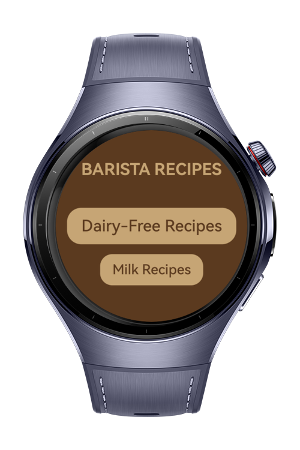
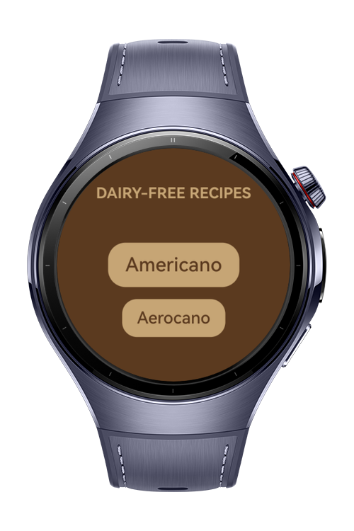
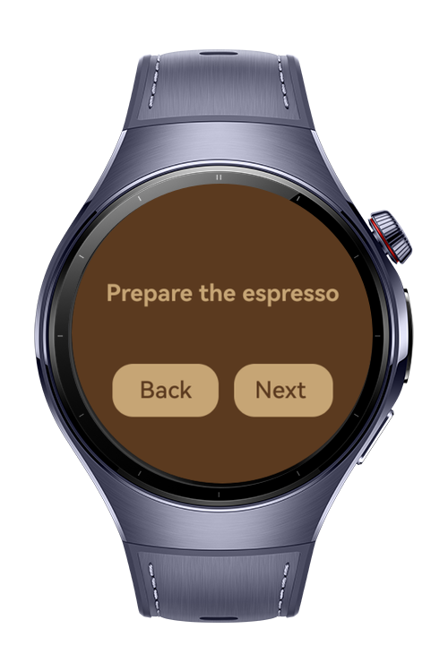
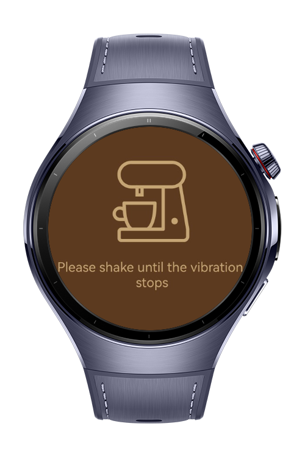

> **Note:** To access all shared projects, get information about environment setup, and view other guides, please visit [Explore-In-HMOS-Wearable Index](https://github.com/Explore-In-HMOS-Wearable/hmos-index).

# BaristaRecipes

BaristaRecipes is a demo app that helps users brew delicious coffee at home. It includes **milk-based** and **non-dairy** recipes and guides you step‑by‑step through preparation. Using **Sensor Kit**, assist with mixing and timing for a more consistent brew.

# Preview

<p align="left">
  
  
  
  
</p>

# Use Cases

BaristaRecipes lets users:

* Browse curated **milk** (e.g., Latte, Cappuccino, Flat White) and **non-dairy** (e.g., Americano, Espresso, Pour‑Over) coffee recipes.
* Follow **step-by-step brewing instructions** with timers and tips.
* Use **Sensor Kit–powered mixing** to track swirl/shake gestures and receive feedback (e.g., “Keep swirling 8s more”).

# Tech Stack

Languages: ArkTS
Frameworks: HarmonyOS SDK 5.1.0(18)
Tools: DevEco Studio Vers 5.1.0.820
Libraries: `@kit.ArkUI`, `@kit.SensorServiceKit`

# Directory Structure

```
  entry/src/main/ets/
  |---entryability
  |   |---EntryAbility.ets
  |---entrybackupability
  |   |---EntryBackupAbility.ets
  |---pages
  |   |---CurrentCoffeeRecipe.ets          // Recipe that user chose will be displayed
  |   |---DairyFreeRecipes.ets             // Recipes without milk list
  |   |---Index.ets                        // Home Page 
  |   |---MilkRecipes.ets                  // Recipes with milk list
  |   |---ReadyCoffee.ets                  // When your coffee is ready this page will be displayed
  |---view
  |   |---CustomButton.ets                 // Reusable custom button
```

# Constraints and Restrictions
## Supported Devices
Huawei Watch 5

# LICENSE

BaristaRecipes is distributed under the terms of the MIT License.  
See the [LICENSE](/LICENSE) for more information.
